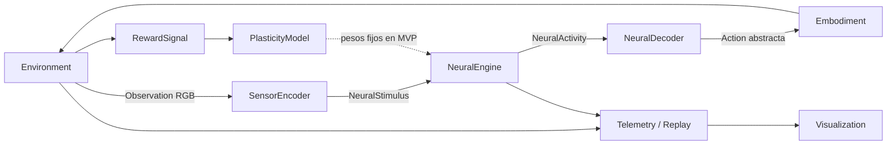

# Arquitectura implementada

Cueca Hero es una implementación de Environment. El core neuronal no importa código
del juego, no interpreta imágenes y no conoce puntuaciones ni botones.

## Contratos

`core/contracts.py` define Observation, NeuralStimulus, NeuralActivity, Action,
RewardSignal y protocolos para Environment, SensorEncoder, NeuralEngine,
NeuralDecoder, Embodiment y PlasticityModel. Environment expone reset, step,
get_observation, get_reward, is_done y get_state.

- `core/malecns.py`: acepta corrientes por índice neuronal y devuelve spikes. Usa el
  contenedor CSR y los kernels numéricos sin cambios de DOOMFLY; no llama a su
  integración sensorial ni a sus controles de juego. El adaptador está contrastado
  con una referencia independiente Brian2 usando estimulación neuronal arbitraria.
- `sensors/visual.py`: muestrea exclusivamente el RGB visible por la proyección
  oficial inferida R1–R6. Aplica el filtro de 10 ms, la corriente saturante y el
  sesgo de lámina de la aproximación DOOMFLY. No accede a notas o recompensa.
- `decoders/directional.py`: cuatro grupos de lectura configurables. Convierte su
  tasa de spikes en pulsos, con umbral y período de espera. No conoce el entorno.
- `embodiments/controller.py`: convierte la acción abstracta en cuatro pulsaciones.
- `environments/cueca_hero.py`: calendario reproducible por semilla, rasterización
  visible, ventana de acierto, puntuación y estado de partida. No depende del cerebro.
- `rewards/`: contrato genérico con magnitud, origen y tiempo.
- `plasticity/`: NoPlasticity explícito. Configuraciones que solicitan aprendizaje
  se rechazan; no se finge un modelo de aprendizaje implementado.
- `telemetry/`: actividad, costo por paso y relojes.
- `replay/`: JSONL con configuración, procedencia y snapshots de cada paso. La
  reproducción observable no vuelve a simular el cerebro ni permite reanudarlo.
- `visualization/brain.py`: coordenadas medidas `somaLocation` de las anotaciones
  verificadas. Selección determinista de 1.800 somas para dibujo; normalización
  uniforme del espacio. No inventa posiciones, axones ni conexiones visuales.
- `frontend/`: dibujo de entorno, visor de somas y telemetría separados. El juego
  muestra el mismo PNG que se obtiene del raster sensorial. No hay política neuronal
  implementada en JavaScript. El audio es una pista original de prueba en 6/8.

## Composición y extensiones

`core/registry.py` registra fábricas por categoría y nombre, detecta duplicados y
rechaza componentes desconocidos. `experiments/runtime.py` registra las implementaciones
y las compone desde `experiments/cueca_hero.json`. Un nuevo Environment se registra
en la composición, sin cambiar MaleCNSCore. El cliente actual muestra la escena de
Cueca Hero; otra escena puede reutilizar los datos de anatomía y la telemetría.

Para añadir un componente: implementar su protocolo, registrarlo en la composición,
y seleccionarlo en la configuración. Si cambia la forma de las acciones, proporcionar
el Embodiment correspondiente. El MVP solo integra el sensor visual; no aparenta
implementar audio, tacto, cuerpos 3D ni otros entornos todavía.

## Relojes y concurrencia

SimulationClock separa paso de juego (1/30 s) y paso neuronal (10 ms). El render usa
requestAnimationFrame y la API devuelve snapshots. La velocidad 0,5×/1×/2× cambia
la frecuencia máxima de pasos; el cómputo lento no salta pasos ni elimina conexiones.
No se promete tiempo real. Los pasos neuronales son múltiplos de 0,1 ms.

Una cola entrega órdenes al único worker que muta la simulación. El servidor HTTP
lee snapshots publicados completos. Pausar detiene ambos relojes; reiniciar limpia
estado, filtros, lecturas y telemetría. Cambiar de controlador reinicia la ejecución.
El modo manual no estimula ni avanza el cerebro.

## Procedencia y límites

Antes de cargar, el runtime verifica el SHA-256 del grafo contra la auditoría de datos.
El kernel nativo verifica fuente y binario; `auto` vuelve a CPU/Numba si no puede usarlo.
No hay CUDA implementado. El checkout upstream permanece sin cambios versionados.

Las salidas DNa02-L, DNpe017-L, DNpe017-R y DNa02-R se asignan a carriles por decisión
de ingeniería, no por una función natural demostrada. No se filtran conexiones por
utilidad para el juego. Ninguna recompensa activa dopamina o altera pesos en el MVP.

Los archivos de preparación siguen usando los algoritmos oficiales; solo cambian ROOT
en memoria para ubicar los derivados en data/. Los requisitos originales completos
se conservan en ARCHITECTURE_REQUIREMENTS.txt.

## Componentes experimentales de percepción

`contrast_visual` añade proyección explícita, contraste y agrupación espacial de
píxeles. `calibrated` lee poblaciones de lámina y puede incorporar pasos anteriores
de actividad. Su calibración supervisada pertenece al decoder, no al conectoma.
El runtime exige coincidencia de hash del grafo, IDs neuronales, parámetros del
sensor y pasos temporales. El hash del lector queda registrado con la sesión.
Se conserva `experiments/cueca_hero_legacy.json` para reproducir el mapeo original.
Ver `PERCEPTION_VALIDATION.md` para resultados y límites de las alternativas.
